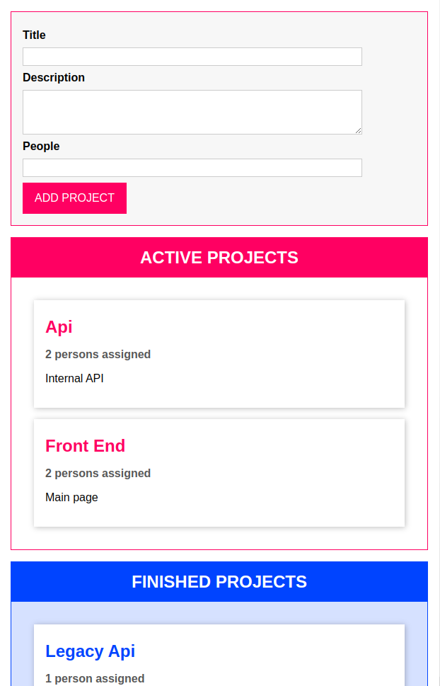

# DragAndDrop project

### Goal:
With this project I used TypeScript to create a drag and drop page, and reproduce a basic state management like in ReactJS.

It's a very simple project and the idea was to use all the knowledge about TypeScript.

